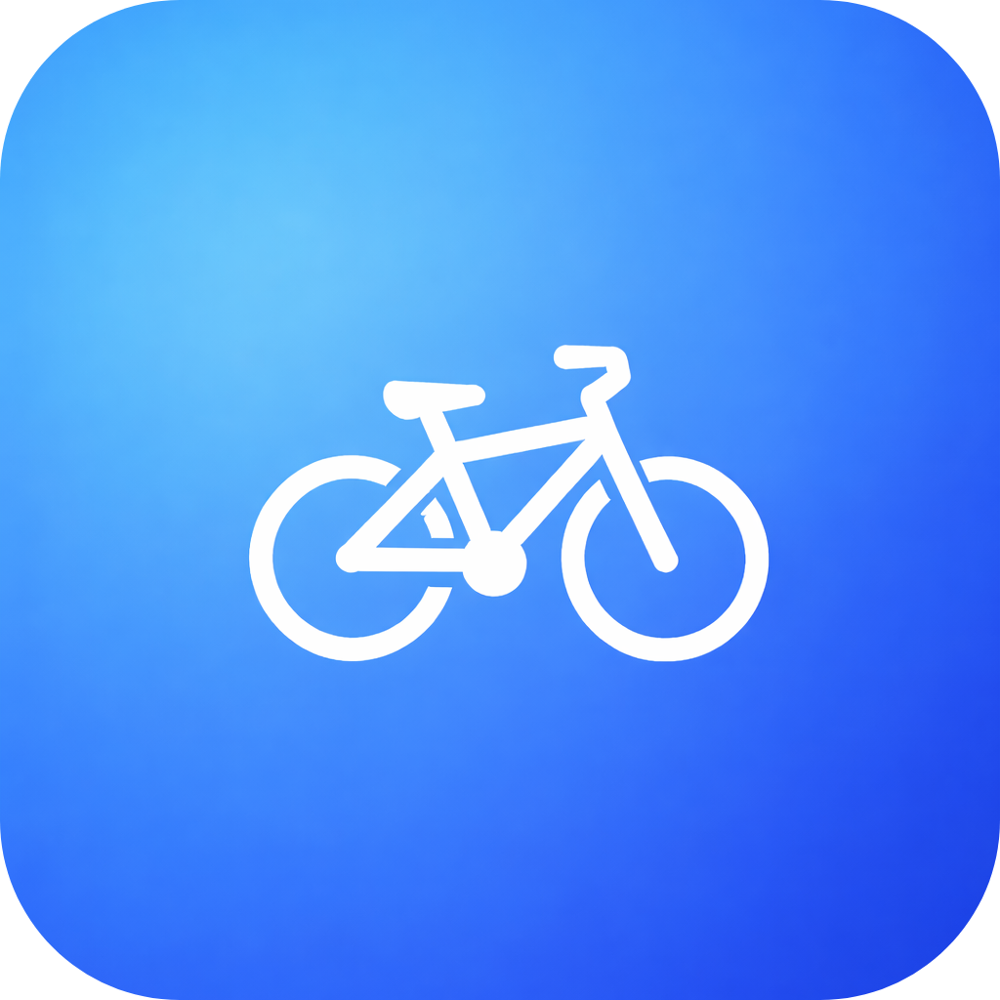

# Best Bike Paths - Software Engineering 2 Project

<p align="center">
  
</p>

**Best Bike Paths (BBP)** is a system designed to improve the cycling experience by collecting, validating, and visualizing information about bicycle paths.
The goal of the project is to support cyclists in choosing safer and higher-quality routes by combining user-generated data with automated processing and validation mechanisms.

**Final Grade:** 30L

# Team
- [**Errigo Simone**](https://github.com/SimoneErrigo) 
- [**Gholami Vajihe**](https://github.com/vajihe-gholami) 
- [**Ianosel Bianca Roberta**](https://github.com/BIA3IA)

## Repository Structure
```
├── ATD/                  # Acceptance Test Document
├── DD/                   # Design Document
├── DeliveryFolder/       # Official submitted documents
├── ITD/                  # Implementation and Test Document
├── RASD/                 # Requirements Analysis and Specification Document
└── README.md
```

## Where to Start

For implementation details and setup, use the dedicated READMEs:

- Application: `IT/CODE/APP/README.md`
- Backend: `IT/CODE/BACKEND/README.md`
- Production deployment (Hetzner + Docker + NGINX): `IT/CODE/BACKEND/README_DEPLOYMENT.md`
